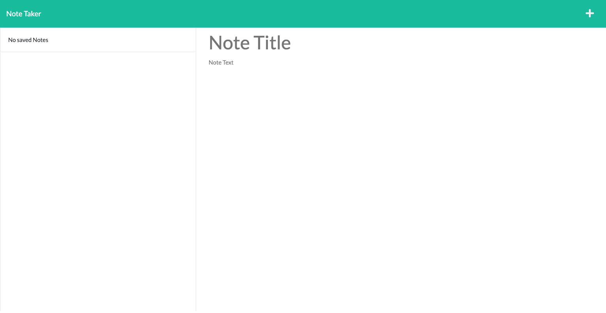

# Note Taker
  ## Table of Contents:
  1. [Description](#description) 
  2. [Instructions](#instructions)
  3. [Use](#use)  
  4. [Contribute](#contribute)
  5. [Tests](#tests)
  6. [License](#license)
  7. [GitHub](#github)
  8. [E-mail](#e-mail)
## Description
This application allows a user to enter notes which will display on a page. 
## Instructions
in order to install the applciation on your computer please follow the following steps:
1. clone the git repo located here: https://github.com/rehpotsirhc21/note-taker
2. Install Node(if applicable)
3. install npm packages uuid, and express
## Use
This application can be used for any number of things. It creates a list of notes that include a title and a description. Some examples of use could be: shopping list, to do list, flash cards etc. 
## Contribute
This project is currently not open to contrabutions. 
## Tests
No tests were written as a part of this project. However, the jest framwork can be used if desired. 
## License

## GitHub
rehpotsirhc21
## E-mail
langnerc@icloud.com

## Links
Heroku: https://fathomless-ravine-24734.herokuapp.com/

repo: https://github.com/rehpotsirhc21/note-taker

Help with unique ID: https://dev.to/rahmanfadhil/how-to-generate-unique-id-in-javascript-1b13